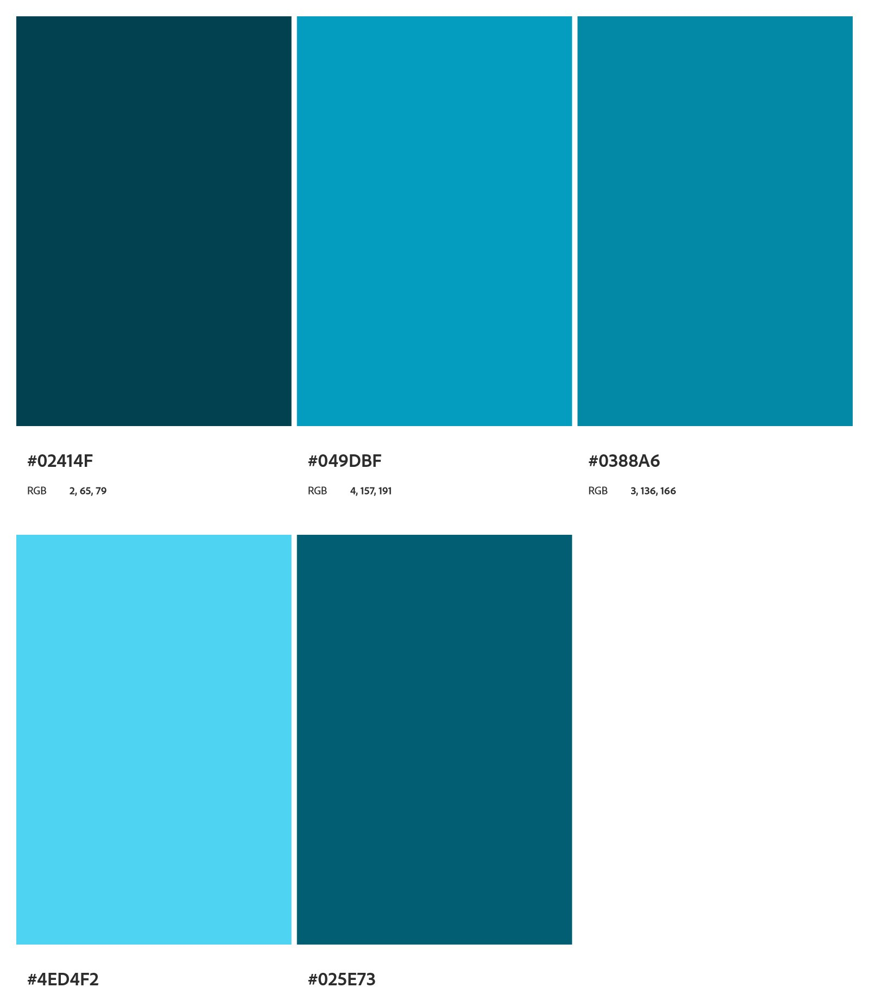
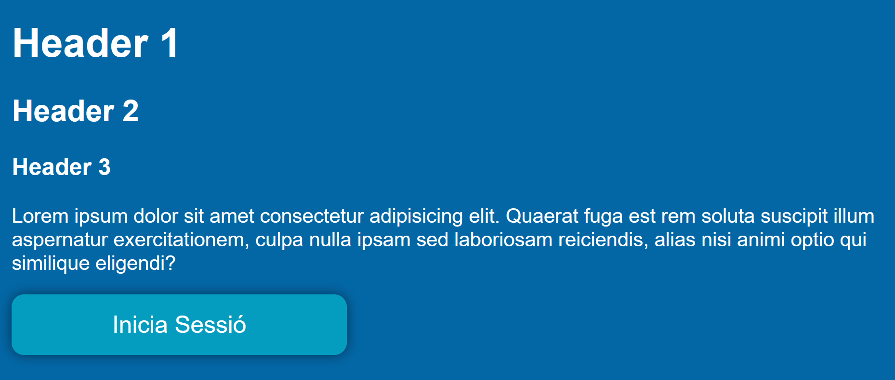

Hem escollit aquesta paleta de colors
    

Com a tipografia hem escollit "Madera W01".

Icon de l'usuari

image::../code/recursos/img/usuario.png[]

Icon del logo

Logo

image::images/logo-blanco.png[]

== Botons

 Color: #049DBF

== Footer 

 Width: 100%

 Height: 40px

 Color: #02414f

== Header:

 Width: 50%

 Color:  #02414f
