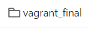
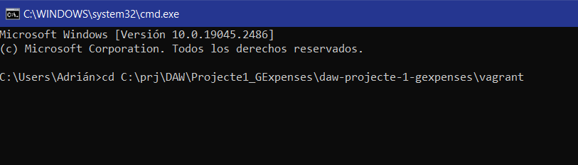
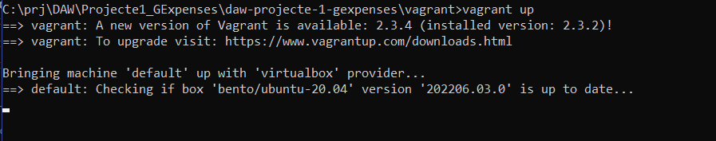
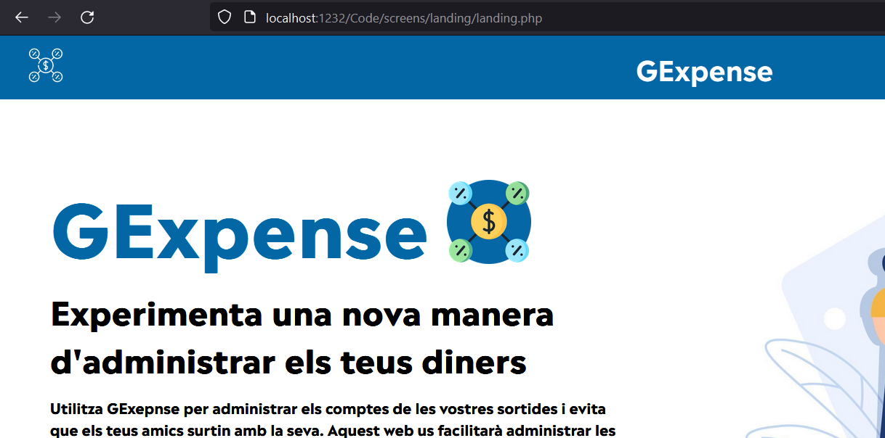

Per instalar la nostre app haurem de tenir instalat https://developer.hashicorp.com/vagrant/downloads[Vagrant].

image::images/vagrantLogo.PNG[]

També haurem d'anar al https://git.copernic.cat/ramirez.masagu.adrian/daw-projecte-1-gexpenses[repositori Git de la nostra aplicació] y descarregar la carpeta de _vagrant_final_.

Una vegada descarregat i descomprimit el repositori, haurem d'obrir un terminal.

Amb el terminal haurem d'entrar a la direcció on hem descomprimit el repositori.

Una vegada dins de la carpeta fem _vagrant up_ i esperem que vagrant axiequi la maquina virtual.

Una vegada aixecada, anirem a _localhost:1232_ on podrem veure la nostra aplicació.

