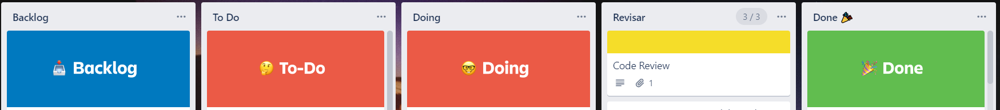

Hem fet la nostra planificació amb https://trello.com[Trello].

S'ha dividit la feina en _"sprints"_ i ara l'última setmana hem repassat les funcionalitats restants i les hem posat en una targeta a part.

També hem agafat una plantilla que ens creava unes targetes per defecte:

=== Backlog

És on creem les tasques cada inici del sprint.

=== To-Do

És on posem les tasques pendents del sprint actual.

=== Doing

És on posem les tasques que estem fent.

=== Revisar

És on posem les tasques que havíem donat per bones, però que hem tornat enrere per revisar.

=== Done

És on posem les tasques acabades.

També cal dir que a partir del segon sprint hem dedicat temps  a tancar tasques que no teníem enllestides.