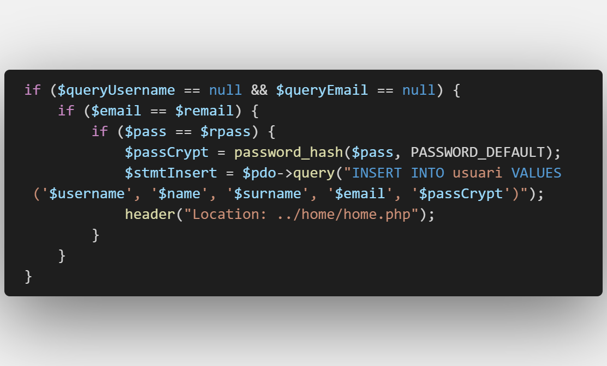
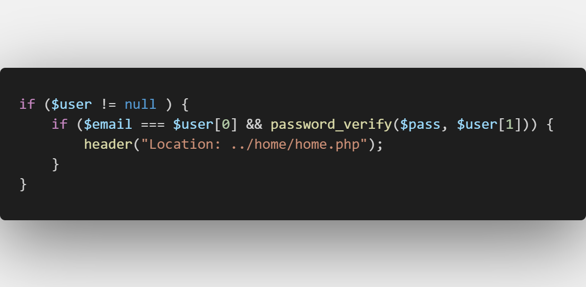

= GExpenses

== Links d'entrega

Link https://drive.google.com/file/d/1ivfmuT9G_Fl20PPW7xsueQk_KQcWfBao/view?usp=sharing[video] presentació.

Link pdf https://drive.google.com/file/d/1EnvVNhArLnH7HePH6zb9GqWHBHOpYUCt/view?usp=sharing[projecte]

Links portafolios:

* Adria https://aramirezma2002.gitlab.io/portafolis/es/[link portfoli]

* Ruben 

* Alexander https://alexanderby54.gitlab.io/alexander_garcia_portafolio/[link portfoli]

== INICI

Per accedir a la nostra pagina web, s'ha de fer el següent

=== Vagrant

La carpeta vagrant s'ubica a l'arrel del nostre repositori

=== Branques

La branca per conectarse es la "main"; en aquesta branca es on pujarem una versió estable de la pagina web

=== Fitxer d'inici

Per accedir a la web, haureu d'entrar a index.php que és a l'arrel del "site"

== Organización proyecto

=== Funcionamiento github desktop

Para gestionar el proyecto utilizamos el github desktop.

.Tipo de ramas en el proyecto:
[NOTE]
====
En la rama .devel es la rama de desarrollo.

En la rama .main es la rama de producción.

En la rama .nombre es la rama propia.

Cada miembro del grupo tiene su propia rama.
====

==== Push 

Haces un push de tu rama .nombre.

Haces un merge de la rama .devel con la de tu .nombre.

==== Pull

Haces un Fetch origin para hacer un pull de la rama .devel.

Haces un merge de la rama .nombre con la rama .devel.

=== Estructura del proyecto

== Introducció
La nostra aplicació consistirá en dues págines principals, la home (on es creen / modifiquen les activitats) i la de despeses (crear/modificar les nostres despeses).
=== Membres 
El nostre grup està compost per Rubén Tabasco, Alexander Garcia i Adria Ramírez.

=== Objectiu 
L'aplicació web té com objectiu organitzar, distribuir i calcular despeses de manera adequada.

== Recollida de requisits

include::RecollidaRequisits.adoc[]

== Manual d'estil
include::GuiaEstil.adoc[]

== Estructura BBDD
include::BBDD.adoc[]

== Disseny
include::Disseny.adoc[]

== Encriptació password

La estrategia que hem escollit nosaltres ha sigut utilitzar llibreries de criptografia internes de PHP.

Hem utilizat dues funcions que son:

* password_hash — Crea un hash de contraseña.

* password_verify — Comproba que la contrasenya coincidex amb un hash.

Hem utilitzat aquestes funcions perque son les funcions que venen amb PHP i son facils d'implementar. Un altre ventatge
es que hi ha un salt de forma que dues contrasenyes iguals no tindran el mateix hash.  

=== Implementació

La funció password_hash s'ha d'implementar justament quan creas un usuari y posteriorment el guardem a la BBDD.

La funció password_verify s'ha d'implementar justament quan vols iniciar sessió amb el usuari creat anteriorment. Obtens la password del usuari amb el hash de la BBDD.

== Pantalles

include::Screens.adoc[]

== Manual d'instal·lació 

include::ManualInstalacio.adoc[]

== Manual de l'usuari

include::ManualUsuari.adoc[]

== Planificació

include::Planificació.adoc[]

== Configuració y creació del nostre entorn Vagrant

include::Vagrant.adoc[]

== Linias futuras

Les linias futuras del projecte GExpenses són:

- El resum del balanç s'actualitzi en temps real.
- Millorar la carrega de dades.
- Pulir algun diseny que altre.

== Conclusions/Aportacions
Una vegada acabat el projecte, estem satisfets amb el resultat. Al llarg del projecte, cadascun de nosaltres hem après a treballar amb llenguatges que abans ens resultaven més aliens (com javascript o php). També ha servit molt la distribució quant a qui fa què, tots hem tocat una mica de tot.

== Webgrafia

- Manual php https://www.php.net/manual/es/index.php[link]
- W3SCHOOL https://www.w3schools.com/[link]
- Manual JavaScript http://jbosom.gitlab.io/apuntspublics/Manuals/JavaScript/ManualJavaScript.html[link]
- Apunts M07 (Curs 22-23) https://quejox.gitlab.io/materialsweb/curs22_23/daw_m07desenvolupamentwebservidor/apunts.html[link]
- M08 Introduccio a Vagrant https://campus.copernic.cat/pluginfile.php/171233/mod_resource/content/1/M08IntroduccioVagrant.html[link]
- MDN web docs_ https://developer.mozilla.org/en-US/[link]
- stackOverflow https://stackoverflow.com/[link]
- Adobe Color https://color.adobe.com/es/create/color-wheel[link]
- FlatIcon https://www.flaticon.es/[link]
- Vagrant oficial https://www.vagrantup.com/[link]
- Trello https://trello.com/es[link]
- SoftCatalà https://www.softcatala.org/corrector/[link]

== Presentació projecte
Hola, som Rubén Tabasco, Adrián Ramírez i Alexander García, i us presentarem el nostre projecte de DAW: Gexpenses. Gexpenses és una pàgina web la qual té com a objectiu administrar els comptes de les activitats que un vulgui. Aquesta web facilitarà administrar les despeses entre amics, familiars, etc.