=== Landing

La "_landing page_" és la pàgina que primer es veu en arribar a l'aplicació. En aquesta pàgina l'usuari es podrà registrar o iniciar sessió.

image::images/landing.PNG[]

=== Registre

En la pantalla de registre l'usuari es podrà crear un compte. Per crear un compte, l'usuari haurà d'omplir un formulari que consisteix en:

- Nom d'usuari
- Nom
- Cognom
- Correu
- Repetir el correu
- Contrasenya
- Repetir contrasenya

image::images/registre.PNG[]

=== Login

En el "_login_" els usuaris que tinguin un compte podran iniciar sessió. En aquesta pàgina hauràs d'indicar el teu correu i la teva contrasenya.

image::images/login.PNG[]

=== Home

El "_home_" és la pantalla on es mostren i es creen activitats. En aquesta pantalla, en el centre, podem veure un missatge on indica que no hi ha cap activitat creada.

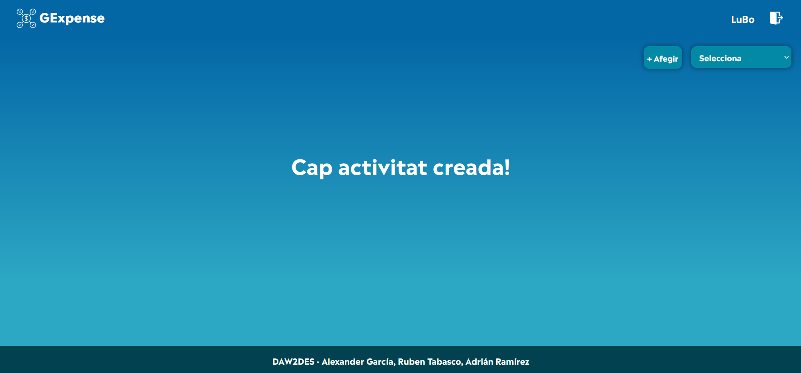

En aquesta pantalla, en el centre, podem veure el llistat d'activitats. També podem veure un botó per afegir activitats i un desplegable per ordenar les activitats per data de creació i per data d'última modificació.

image::images/home.PNG[]

==== Tarjetes

Cada activitat té una targeta. En aquesta targeta podem veure el nom de l'activitat, les despeses i la data de creació.

A més a més, en la part superior dreta són les icones per afegir usuaris a l'activitat i per eliminar aquesta activitat. En l'esquena inferior esquerra es pot veure el compte d'usuaris totals de l'activitat.

Actualment no es poden afegir imatges a l'activitat.

image::images/targeta.PNG[]

==== Afegir activitats

Les activitats s'afegeixen fent clic al botó d'afegir:

image::images/afegir.PNG[]

En fer clic s'obrirà un "_popup_" amb un formulari que l'usuari ha d'omplir per crear una activitat. Aquestes dades són:

- El nom de l'activitat
- El tipus de divisa

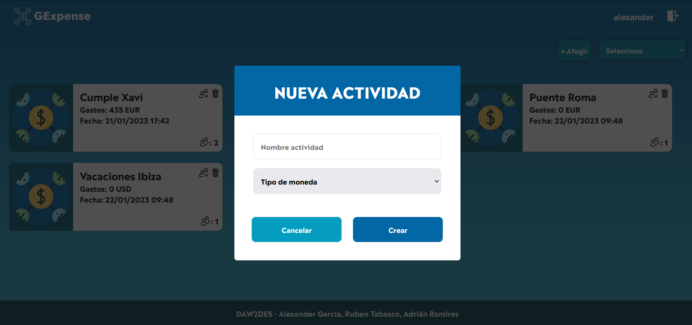

==== Invitar usuaris

Per invitar usuaris s'haurà de fer clic sobre el botó amb la icona amb les dues persones i un més que tenen totes les targetes:

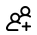

Al prémer sobre aquesta icona, s'obrirà un "_popup_" amb un camp per introduir els correus de les persones a les quals vols invitar. Una vegada introduir els correus es poden enviar.

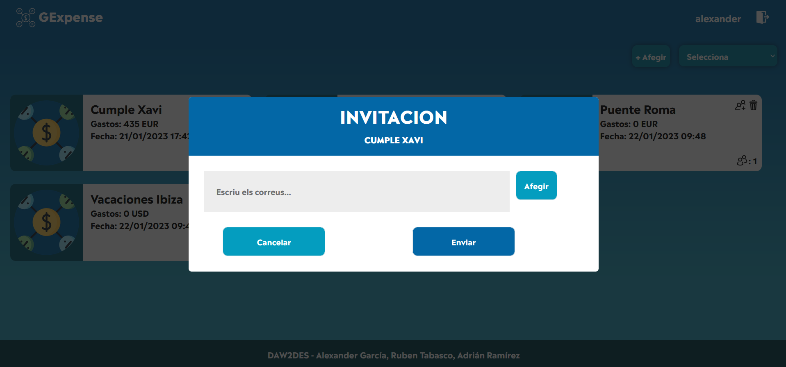

Per poder escriure correus hi ha dues formes, escrius el correu amb el format correcte i cliques l'enter i l'altre és afegir amb el botó de la dreta. També pots esborrar el correu clicant la x del costat.

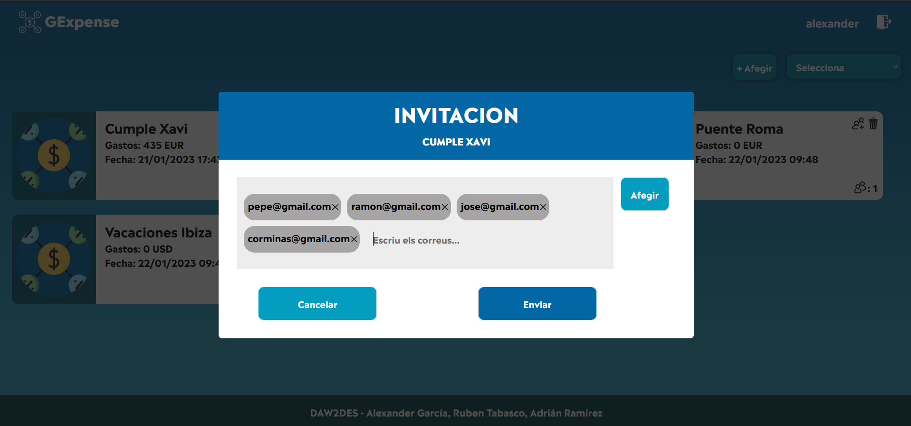

===== Tipus d'invitacions

Hi ha dos tipus d'invitacions, una invitació per les persones no registrades i un altre per a les persones que si estan registrades.

====== Invitació registrat

En aquesta invitació es veu un missatge...

_QUEDA PENDENT, S'ESTÁ FENT UN REFACTOR_

====== Invitació no registrat

En aquesta invitació es veu un missatge...

_QUEDA PENDENT, S'ESTÁ FENT UN REFACTOR_

=== Activitat

Aquesta es la pantalla on surten les despeses i les persones de la activitat:

==== Despeses

La "_activitat_" és la pantalla on es mostren i es creen despeses, es visualitzan els membres de l'activitat i visualitzes el balanç. En aquesta pantalla, en el centre, podem veure un missatge on indica que no hi ha cap despesa creada.

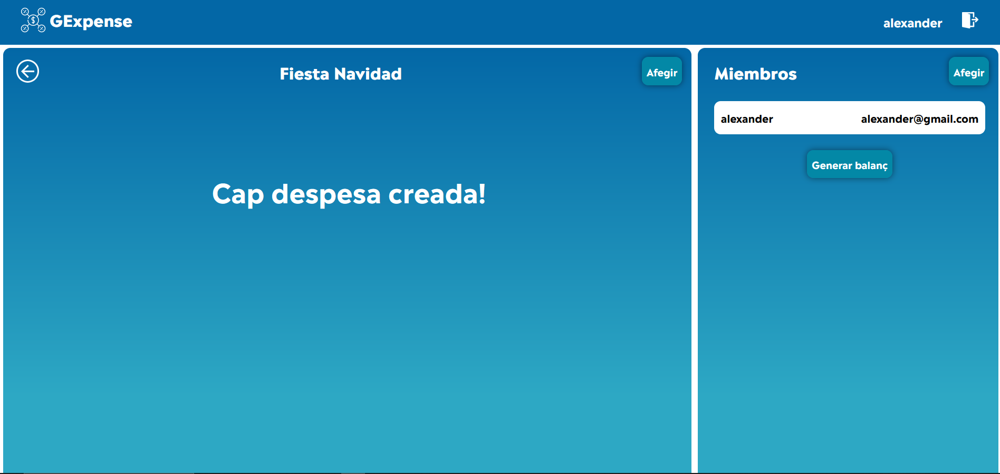

En aquesta pantalla, en la part esquerra, podem veure el llistat de despeses. També podem veure un botó per afegir despeses. En la part dreta, podem veure el llistat del membres. També podem veure un botó per afegir membres a l'activitat i un botó per visulitzar el balanç. 

image::images/activitat.PNG[]

===== Afegir despeses

Per afegir una despesa perimer s'haurá de seleccionar el tipus de despesa. Hi han dos tipus de despeses:

- Despesa avançada
- Despesa simple

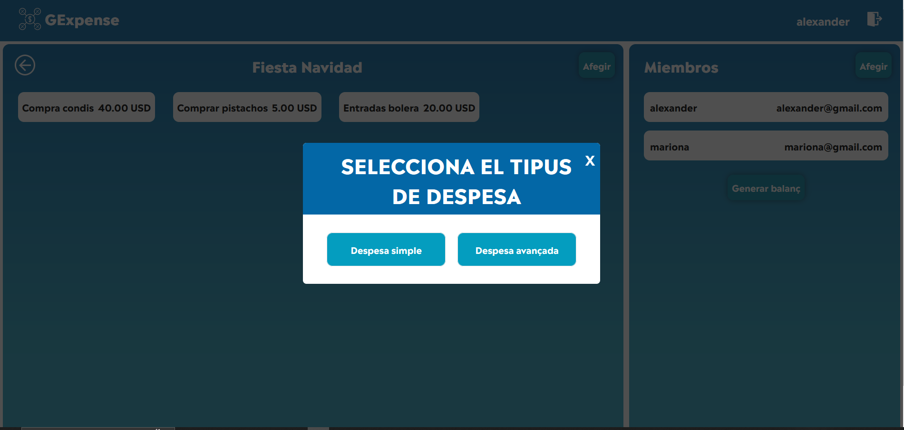

====== Despesa Simple

En una despesa simple la quantitat es dividirá per igual entre tots els integrants de l'activitat.

Per crear una despesa simple s'haurá d'indicar:

- Nom de la despesa
- Quantiat de la despesa
- Nom del que paga

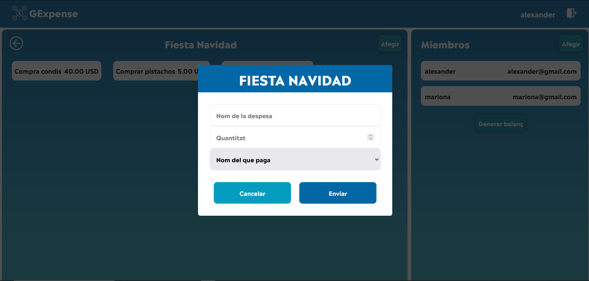

====== Despesa Avançada

En la despesa avançada es podrá seleccionar quines persones formen part de les despeses y quin porcentatge o import tindrá cada usuari.

Per crear una despesa avancçada s'haurá d'indicar:

- Nom de la despesa
- Quantitat de la despesa
- Seleccionar y afegir l'usuari
- Indicar quin percentatge o import correspon a cada usuari

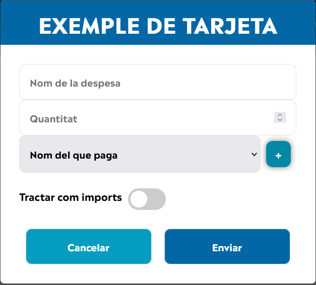

Exemple d'una despesa avançada amb un usuari afegit

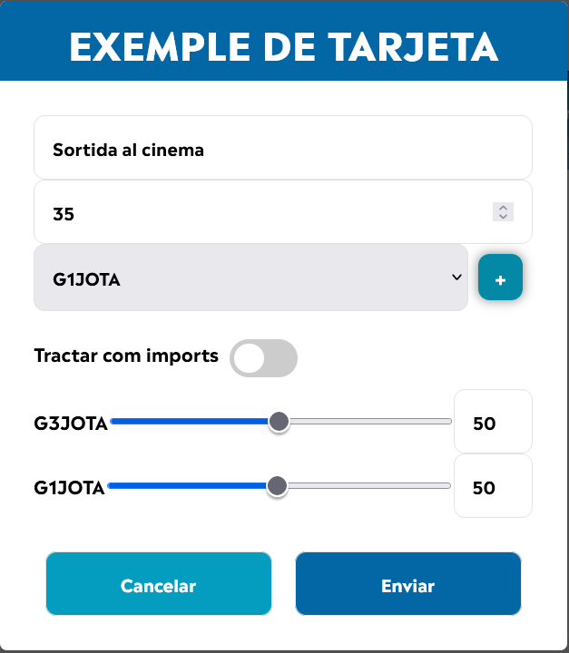

==== Despesa informació

Per poder visualitzar la informació de la despesa si li donem clic a la despesa sortirà un "pop Up" amb la informació.

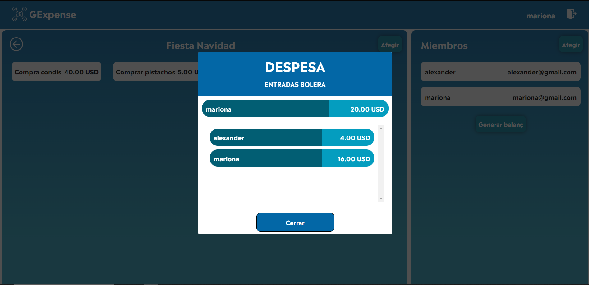

==== Balanç 

El "_balanç_" és un pop Up on es mostra el resum del balanç i el càlcul dels deutes. En aquesta imatge es pot visualitzar el balanç sense cap dada.

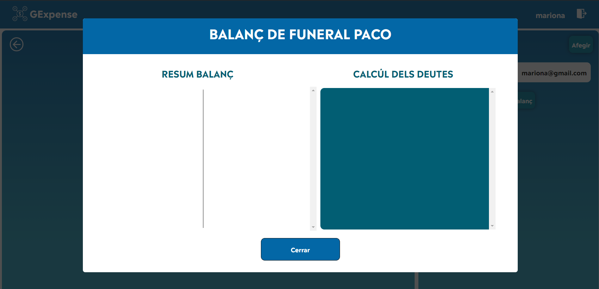

El balanç amb deutes.

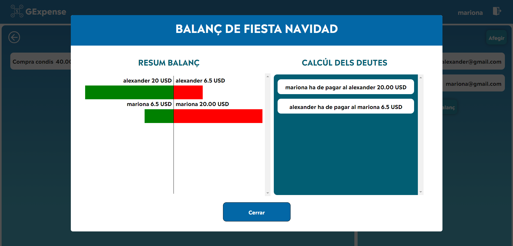

Per poder fer pagaments has de fer clic al deute i automàticament es tatxara.

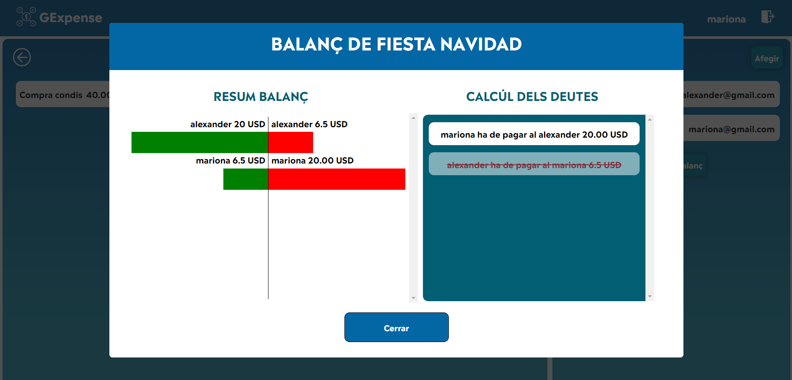

Per visualitzar els canvis has de sortir del pop Up i tornar a entrar.

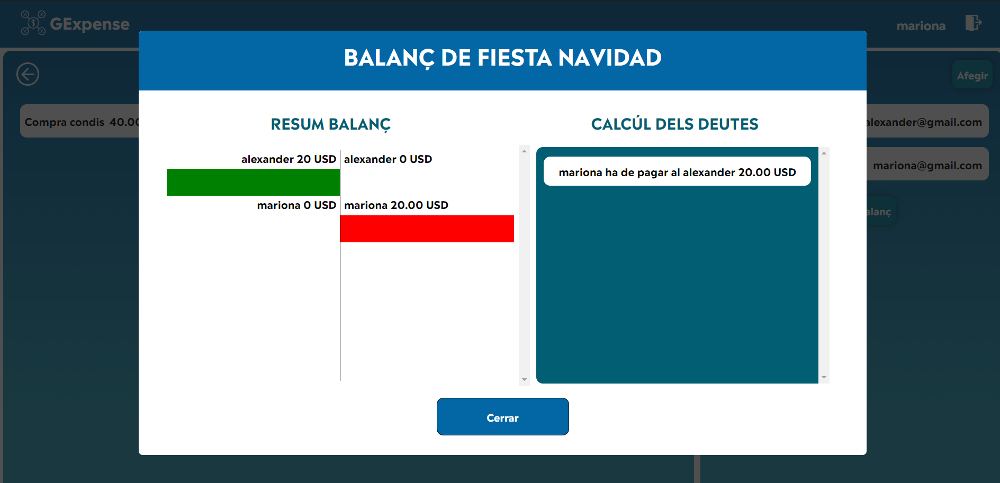