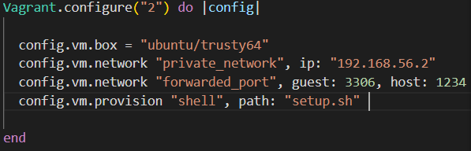
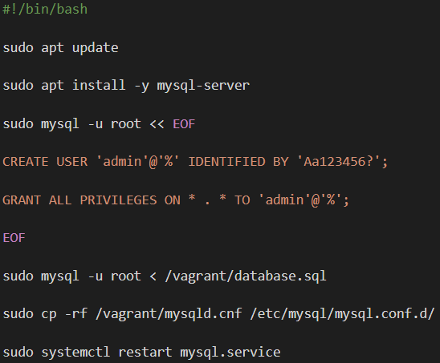

=== Per a que utilitzarem Vagrant?

Utilitzarem Vagrant per generar una màquina virtual molt simple i tindre una BBDD comuna i de fàcil accés.

=== Configuració del Vagrantfile

En el nostre Vagrantfile tindrem tot el necessari per dirigir el nostre entorn Vagrant.

* config.vm.box - Indiquem el nom del box que volem utilitzar. El nom el trèiem del cloud de Vagrant.

* config.vm.network "private_network" - Indiquem l'ip que utilitzarà la màquina virtual.

* config.vm.network "forwarded_port" - Indiquem el port de la màquina virtual que volem vincular amb un port de la màquina real.

* config.vm.provision - Indiquem la ruta del fitxer de __bash__ que volem que s'executi en iniciar.

=== Configuració del script

Anem pas per pas:

1. Ferm un __update__ per actualitzar el repositori d'Ubuntu.

2. Instal·lem __mysql__ amb __apt install mysql-server__. A més a més, l'indicarem el paràmetre __-y__ per fer que a totes les preguntes que ens demanen, automàticament, respondre sí.

3. Una vegada instal·lat, crearem un usuari amb el qual entrarem a la BBDD. Ho farem per connectant-nos ambl'usuari __root__ de __mysql__ i fent un __EOF__ amb les comandes pertinents.

4. A continuació executarem el nostre script de creació de BBDD.

5. Continuem copiant i pegant el fitxer de configuració editat amb la línia que conté la __bind_address_ comentat. Això ens permetrà connectar-nos a la BBDD.

6. Finalment, reiniciem el servei de __mysql__.

=== Iniciació del Vagrant

Per iniciar Vagrant anirem a través del terminal a la carpeta on tenim els arxius i farem __vagrant up__